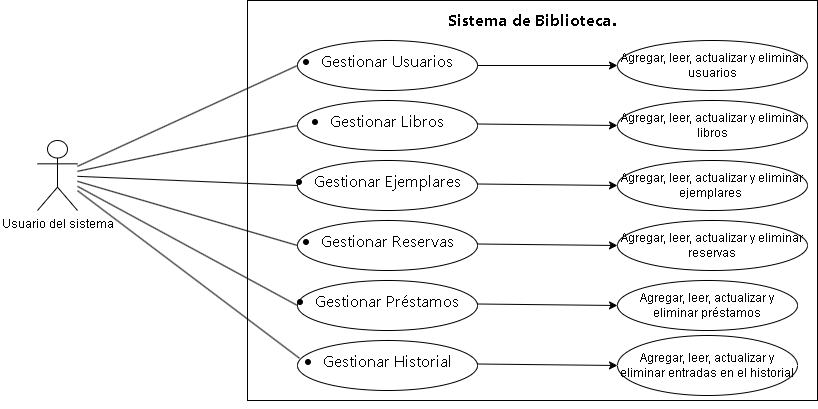

# 📚 Proyecto CRUD para Biblioteca con MySQL y Flask

_Este proyecto es un sistema de gestión de biblioteca que permite realizar operaciones CRUD (Crear, Leer, Actualizar, Eliminar) sobre las tablas:_
**Usuarios, Libros, Ejemplares, Reservas, Préstamos e Historial,** utilizando:

- **Backend:** Python + Flask
- **Base de datos: **MySQL
- **Frontend:** HTML + Bootstrap

## 🛠️ Tecnologías Utilizadas

| **tecnologia**  |**funcion**   |
| ------------ | ------------ |
| Python 3  |Lenguaje principal del backend   |
| Flask  | Framework web para rutas y lógica  |
| Flask-MySQLdb  | Conexión con MySQL  |
| MySQL  |  Base de datos relacional |
| Bootstrap 5  | Diseño responsive de las plantillas  |
|Git  |Control de versiones   |


### 📋 Pre-requisitos
- Python 3.8+
- MySQL
- Pip

### 🚀 Instalación y Configuración
**1. Clona el repositorio**

   ``git clone https://github.com/tu-usuario/Proyecto_BaseDeDatos_MySQL.git  
cd Proyecto_BaseDeDatos_MySQL   ``

**2. Crear un entorno virtual**

``python -m venv venv  
source venv/bin/activate  # Linux/macOS  
venv\Scripts\activate     # Windows   ``

**3. Instalar dependencias**

``pip install -r requirements.txt  ``

**4. Configurar MongoDB**

- Instalar MySQL Server y crear una base de datos llamada biblioteca.
- Configurar las credenciales en app.py:
```app.config['MYSQL_HOST'] = 'localhost'  
app.config['MYSQL_USER'] = 'tu_usuario'  
app.config['MYSQL_PASSWORD'] = 'tu_contraseña'  
app.config['MYSQL_DB'] = 'biblioteca'  
```

** 5. Ejecutar la aplicación**

``python app.py  ``

### 📂 Estructura del Proyecto

```Proyecto_BaseDeDatos_MySQL/  
├── app.py                # Backend (rutas y lógica)  
├── requirements.txt      # Dependencias (Flask, Flask-MySQLdb)  
├── templates/            # Plantillas HTML  
│   ├── base.html         # Plantilla común  
│   ├── usuario.html      # CRUD Usuarios  
│   ├── libro.html        # CRUD Libros  
│   ├── ejemplar.html     # CRUD Ejemplares  
│   ├── reserva.html      # CRUD Reservas  
│   ├── prestamo.html     # CRUD Préstamos  
│   └── historial.html    # CRUD Historial  
└── README.md             # Este archivo  
```
### 📋Diagrama de casos de uso



### 🔍 Funcionalidades

**Operaciones CRUD para cada colección:**

- Crear registros (usuarios, libros, etc.).
- Leer/visualizar datos en tablas Bootstrap.
- Actualizar registros existentes.
- Eliminar registros.

**Interfaz intuitiva**

- Menú de navegación entre secciones.

- Formularios integrados en las tablas.

- Diseño responsive gracias a Bootstrap.

### 📝 Notas Adicionales

**Cambios en app.py:**
- Se reemplazó PyMongo por Flask-MySQLdb.
- Las consultas ahora usan SQL (ej: SELECT * FROM usuarios).
- Las plantillas mantienen el mismo diseño pero se adaptan a los datos de MySQL.

### 📬 Contacto
✉️ Email: gomezhiguitajuan@gmail.com

<p align="center"> ✨ **¡Gracias por usar este proyecto!** ✨ </p>
